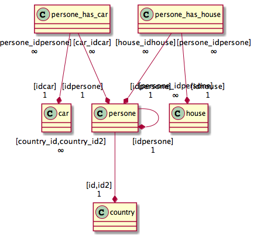
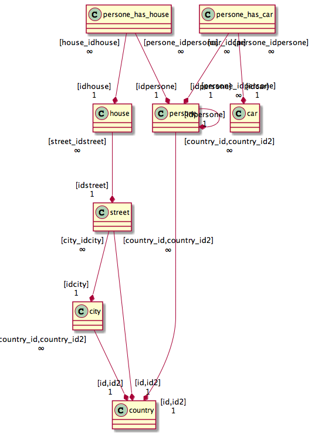

# lazada-com/database_minifier

Tool for copy records from one Mysql database to another with all dependencies.

Additional features:

* Build database UML (http://plantuml.com/)
* Build array/json 2-level tree for representation database

## Install

Via Composer

Add information about new package in your `composer.json`

    "repositories": [
        ...
        {
          "type": "vcs",
          "url": "https://github.com/lazada-com/database_minifier",
          "name": "lazada-com/database_minifier"
        }
    ],
    
    "require-dev": {
        "lazada-com/database_minifier": ">=0.0.1"
    },

## Usage (DatabaseMinifier)

Create new object:

    $dm = new \Lazada\DatabaseMinifier\DatabaseMinifier($masterConfig, $slaveConfig);
    
Where configs in format
    
    array('dbname' => {DBNAME}, 'username' => {USERNAME}, 'password'=> {PASSWORD}, 'host' => {HOST}[, 'driver_options' => {options}])

### DatabaseMinifier::buildArrayTree()

You can build your database tree and use it in your purposes in format 

    [
        "%table%": [
            "primary_key": ["%PK1%", "%PK2%" /* , ... * /],
            "references": [
                "%table%": [
                    ["%fk%": "%pk%" /* , ... * /] /* , ... * /
                ] /* , ... * /
            ],
            "referenced_by": [
                "%table%": [
                    ["%fk%": "%pk%" /* , ... * /] /* , ... * /
                ] /* , ... * /
            ]
        ] /* , ... * /
    ]

### buildJsonTree()

Returns Json object like `DatabaseMinifier::buildArrayTree()`

### copyRecordsByCriteria($tableName, array $criteria = [], $copyReferencedBy = true)

Copy all records (with all dependencies) from master `db` to salve. If `$copyReferencedBy` is `true` it will also copy 
all records depends on found records. 

### copyRecordsByPks($tableName, array $pks = [])

See `DatabaseMinifier::copyRecordsByCriteria` 

### copyRecordsByPks($tableName, $pk)

See `DatabaseMinifier::copyRecordsByPks`
See `DatabaseMinifier::copyRecordsByCriteria`

### buildPlantuml($tables = [], $references = true, $referenced = true)

Build text-based uml for DB

See http://plantuml.com/

#### Examples:  

## Testing

* Create databases for tests: e.g. `test_master` AND `test_slave`
* Install master dump `mysql -uroot test_master < tests/_data/master_dump.sql`
* Copy structure from master database to slave 
    *  `mysqldump -uroot test_master --add-drop-table --no-data --verbose --result-file=/tmp/slave_dump.sql`
    * `mysql -uroot test_slave < /tmp/slave_dump.sql`
* Copy `tests/BaseTest.php.dist` to `tests/BaseTest.php` and configure it - set your databases coordinates 
* Copy `phpunit.xml.dist` to `phpunit.xml`
* Run tests `phpunit -c phpunit.xml`

## Contributing

Please see [CONTRIBUTING](./CONTRIBUTING.md) for details.

## Credits

- [Dmitriy Paunin](https://github.com/paunin)
- [Ruben Ribeiro](https://github.com/rmribeiro)

## License

The MIT License (MIT). Please see [License File](LICENSE.md) for more information.
